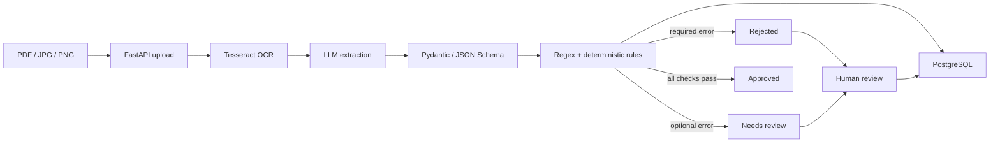
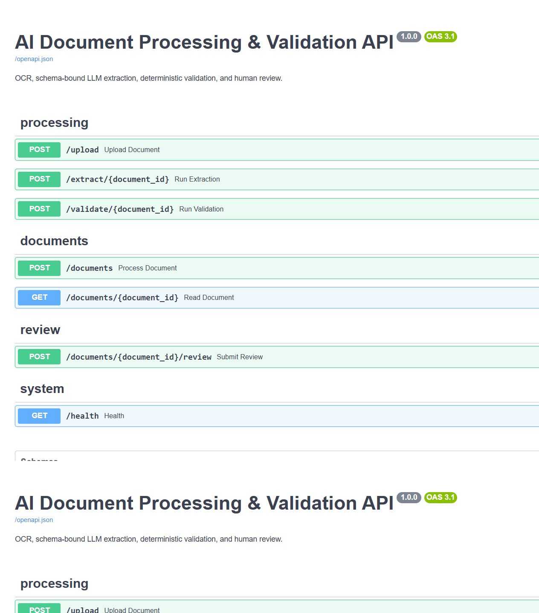
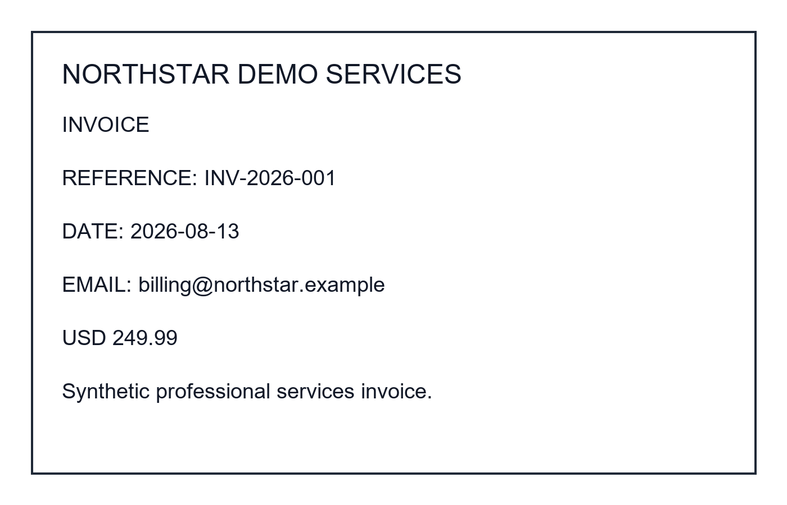

# AI Document Processing & Validation Platform

An end-to-end backend that turns scanned PDF/JPG/PNG documents into schema-validated records. It combines Tesseract OCR, optional OpenAI structured extraction, deterministic business rules, PostgreSQL persistence, a human-review workflow, JSON logging, PyTest coverage, and Docker deployment.

> All files in `sample_docs/` are synthetic. The default `LLM_MODE=mock` is deterministic and makes no paid API calls.

## Architecture



The LLM is not the acceptance authority. Every model response must match `ExtractedFields`, and deterministic validation decides the final status.

## What is implemented

- File-signature and MIME validation for PDF, JPG, and PNG uploads (10 MB default limit)
- Local file storage using generated names rather than unsafe client filenames
- Tesseract OCR for images and Poppler-backed PDF page conversion
- OpenAI Responses API Structured Outputs with a strict Pydantic-generated JSON Schema
- Free deterministic mock extraction for local development and demos
- Regex/date/amount/required-field validation with auditable status rules
- PostgreSQL tables for documents, extraction revisions, and validation results
- Human correction and approval through `POST /documents/{id}/review`
- Structured JSON logs without OCR text, extracted values, API keys, or secrets
- Typed errors for unsupported/corrupted files, OCR failures, LLM failures/timeouts, invalid model JSON, and database failures
- 17 PyTest tests covering API, schema, validation, storage, OCR error classification, and review workflow

## API

| Method | Path | Purpose |
| --- | --- | --- |
| `GET` | `/health` | Liveness check |
| `POST` | `/upload` | Validate and store a document |
| `POST` | `/extract/{id}` | Run OCR and structured extraction |
| `POST` | `/validate/{id}` | Apply deterministic validation |
| `POST` | `/documents` | Run upload → OCR → extraction → validation |
| `GET` | `/documents/{id}` | Return current state, extraction, and errors |
| `POST` | `/documents/{id}/review` | Save corrected fields and a review decision |

Interactive documentation is available at `http://localhost:8000/docs`.



## Quick start with Docker

Prerequisite: Docker Desktop or another running Docker Engine.

```bash
docker compose up --build
```

This starts FastAPI on port `8000` and PostgreSQL 16 with persistent named volumes. Mock extraction is enabled by default, while Tesseract and Poppler are installed in the API image.

```bash
curl http://localhost:8000/health
# {"status":"ok"}
```

Stop the stack with `docker compose down`. Add `-v` only when you intentionally want to delete the database and uploaded-document volumes.

## Verified end-to-end

The Docker stack has been built and exercised with real Tesseract OCR, Poppler PDF conversion, PostgreSQL persistence, all three validation outcomes, human correction, staged processing, structured logs, and negative upload cases. Run the repeatable smoke test while the stack is up:

```bash
python scripts/e2e_smoke.py
```

See [the verification record](docs/VERIFICATION.md) for observed results and the explicit limitation that OpenAI mode still requires a configured API key for a live model-call test.

## Local setup

Python 3.12 is recommended. Local OCR also requires the `tesseract` executable; PDF OCR additionally requires Poppler. Docker is the simplest reproducible setup because both are already included.

```bash
python -m venv .venv
source .venv/bin/activate       # Windows PowerShell: .\.venv\Scripts\Activate.ps1
pip install -r requirements.txt
cp .env.example .env           # Windows PowerShell: Copy-Item .env.example .env
uvicorn app.main:app --reload
```

For a lightweight local run without PostgreSQL, set `DATABASE_URL=sqlite:///./docai.db`. The default in `.env.example` targets the Compose PostgreSQL service.

## Process a sample

Run the complete pipeline in one call:

```bash
curl -X POST http://localhost:8000/documents \
  -H "accept: application/json" \
  -F "file=@sample_docs/invoice_valid.png;type=image/png"
```

Representative response:

```json
{
  "id": "6c950e22-bce8-46e1-a514-0d0623c5bcb4",
  "filename": "invoice_valid.png",
  "content_type": "image/png",
  "status": "approved",
  "processing_state": "validated",
  "raw_text": "NORTHSTAR DEMO SERVICES\nINVOICE ...",
  "extracted_data": {
    "document_type": "invoice",
    "party_name": "NORTHSTAR DEMO SERVICES",
    "date": "2026-08-13",
    "amount": "249.99",
    "email": "billing@northstar.example",
    "reference_number": "INV-2026-001",
    "summary": "USD 249.99 Synthetic professional services invoice."
  },
  "validation_errors": [],
  "error_message": null,
  "created_at": "2026-08-13T12:00:00Z",
  "updated_at": "2026-08-13T12:00:01Z"
}
```

The five included samples demonstrate clean image/PDF extraction, an invalid optional email, a missing required reference, and an invalid required date:



Regenerate them with `python scripts/generate_samples.py`.

## Validation and confidence rule

This project deliberately uses a simple rules-based status, not a learned confidence model.

| Condition | Status |
| --- | --- |
| Required values exist and every supplied value passes validation | `approved` |
| Required values pass but an optional email or amount is malformed | `needs_review` |
| A required type, party, date, or reference is missing/malformed | `rejected` |
| OCR/LLM processing cannot complete | `failed` |

Rules include calendar-valid dates, positive decimal amounts, email syntax, hyphen-separated reference formats, and missing-value checks. Each issue records its field, code, message, and severity.

## Human review

A reviewer submits a complete corrected object. Corrections create a new extraction revision, preserving the original LLM result.

```bash
curl -X POST http://localhost:8000/documents/DOCUMENT_ID/review \
  -H "Content-Type: application/json" \
  -d '{
    "reviewer": "quality@example.test",
    "approve": true,
    "corrected_fields": {
      "document_type": "invoice",
      "party_name": "CEDAR LABS SAMPLE LLC",
      "date": "2026-08-13",
      "amount": "88.40",
      "email": "accounts@cedarlabs.example",
      "reference_number": "INV-2026-003",
      "summary": "Synthetic corrected invoice"
    }
  }'
```

An approval request cannot override malformed required fields; it remains `rejected` until the corrected object passes validation.

## OpenAI mode

Copy `.env.example` to `.env`, then set:

```dotenv
LLM_MODE=openai
OPENAI_API_KEY=your_key_here
OPENAI_MODEL=gpt-4o-mini
```

The integration uses the Responses API with `text.format.type=json_schema`, strict schema adherence, `store=false`, a configurable timeout, and a Pydantic validation pass before persistence. See the official [OpenAI Structured Outputs guide](https://developers.openai.com/api/docs/guides/structured-outputs).

Never commit `.env`; it is excluded by `.gitignore`. The logger only permits a small allowlist of operational metadata and never records document contents or credentials.

## Database model

- `documents`: upload metadata, status, processing state, review metadata, errors, and timestamps
- `extractions`: OCR text, structured JSON, extraction source/model, and revision timestamps
- `validation_results`: status, validity flag, issue JSON, and the exact extraction revision validated

SQLite works for tests and quick local development. PostgreSQL is the intended application database and is configured in `docker-compose.yml`.

## Tests

```bash
pytest -q
pytest -q --cov=app --cov-report=term-missing
```

The suite does not require a live LLM, PostgreSQL, Tesseract, or Docker daemon. External boundaries are isolated so rule behavior and failure handling stay deterministic.

## Vercel deployment

Vercel automatically detects `app/main.py` as a FastAPI entrypoint. The repository includes `.python-version`, `.vercelignore`, and `vercel.json` so the API bundle uses Python 3.12 and excludes Docker/test/sample assets.

```bash
vercel
vercel --prod
```

Live API documentation: <https://ai-document-processing-validation.vercel.app/docs>

The root URL redirects to `/docs`. Use `/health` for liveness and `/health/ready` to see the database, persistence, and OCR capabilities of the current runtime.

Vercel automatically selects a serverless-compatible **RapidOCR + ONNX Runtime** backend and uses **PDFium** for PDF rendering. Docker/local deployments continue to use **Tesseract + Poppler**, preserving the originally verified OCR architecture.

The hosted workflow was smoke-tested with the synthetic PNG invoice: upload, OCR, structured mock extraction, JSON-schema parsing, deterministic validation, and the `approved` response all completed successfully.

Important platform boundaries:

- Vercel's native Python runtime does not install Tesseract or Poppler, so it uses the packaged RapidOCR/PDFium fallback instead.
- The local `vendor/opencv-python` dependency shim selects headless OpenCV, avoiding unnecessary GUI libraries and keeping the Python function under Vercel's deployment-size limit.
- Vercel local disk is not durable. Vercel-aware defaults use writable `/tmp` paths only to keep the API bootable.
- Set `DATABASE_URL` to an external PostgreSQL provider such as Neon for durable records. Vercel's marketplace injects provider connection variables; plain `postgres://` and `postgresql://` URLs are normalized automatically.
- Without external PostgreSQL, one-call `/documents` processing works but records and uploads are ephemeral; staged processing and later human review are not reliable across cold starts.

These limitations are reported by `/health/ready` instead of being hidden.

## Project structure

```text
app/
  config.py              environment configuration
  database.py            SQLAlchemy engine/session
  exceptions.py          typed processing errors
  llm.py                 mock + OpenAI structured extractors
  logging_config.py      JSON operational logging
  main.py                FastAPI application and error handlers
  models.py              PostgreSQL/SQLAlchemy tables
  ocr.py                 Tesseract and PDF conversion
  routes.py              API endpoints
  schemas.py             Pydantic contracts
  service.py             pipeline orchestration
  storage.py             safe local upload handling
  validation.py          deterministic validation rules
tests/                    unit and API workflow tests
sample_docs/              five synthetic OCR fixtures
logs/                     runtime JSON logs (ignored)
uploads/                  local uploads (ignored)
Dockerfile
docker-compose.yml
requirements.txt
.env.example
.python-version
.vercelignore
vercel.json
```

## Production follow-ups

This first version intentionally favors a clear, demonstrable pipeline. Before production use, add authentication/authorization for reviewers, object storage and malware scanning, Alembic migrations, background jobs for long OCR requests, encrypted sensitive data, retention policies, rate limits, and metrics/tracing.

## Resume-ready description

**AI Document Processing & Validation Platform | Python, FastAPI, PostgreSQL, SQL, LLM, Tesseract OCR, JSON Schema, PyTest, Docker**

- Built an end-to-end document-processing platform combining OCR and LLM extraction with schema validation, deterministic business rules, PostgreSQL persistence, and human-review workflows.
- Designed validation gates so AI-generated outputs are verified before acceptance, with invalid or incomplete records routed to controlled review.
- Developed typed FastAPI endpoints, SQLAlchemy data models, structured logging, error handling, PyTest coverage, and containerized deployment.

